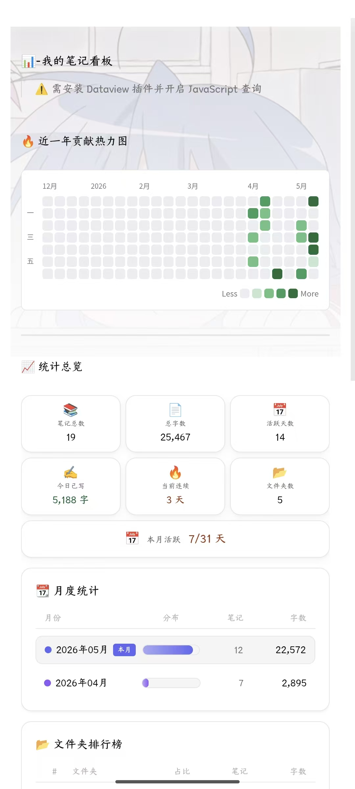
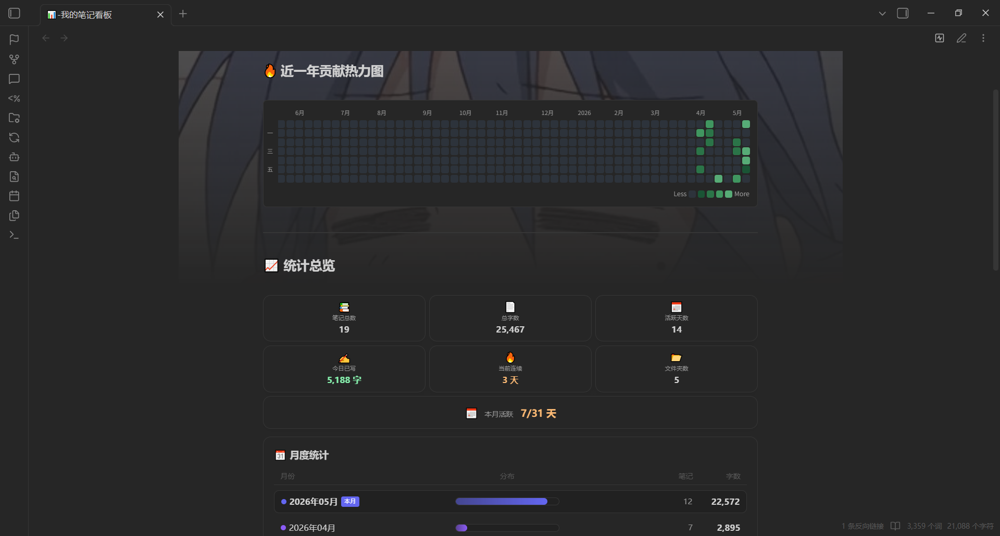
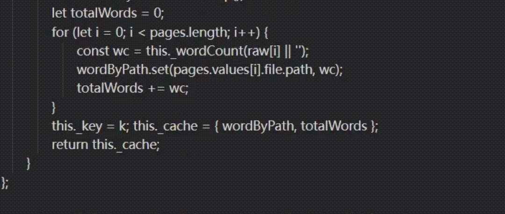
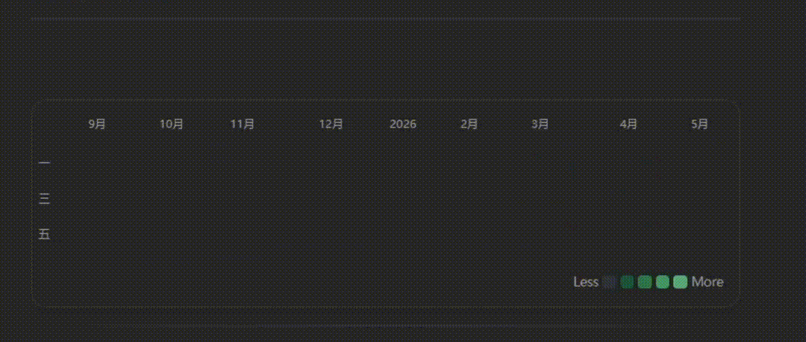
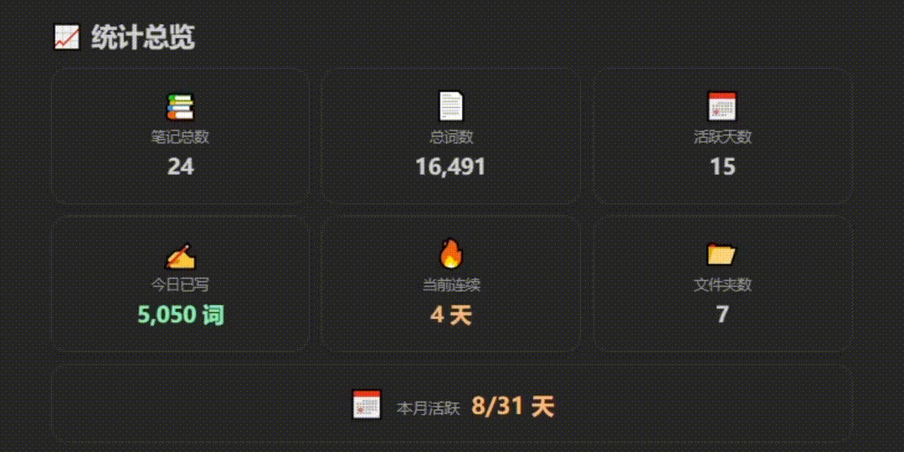
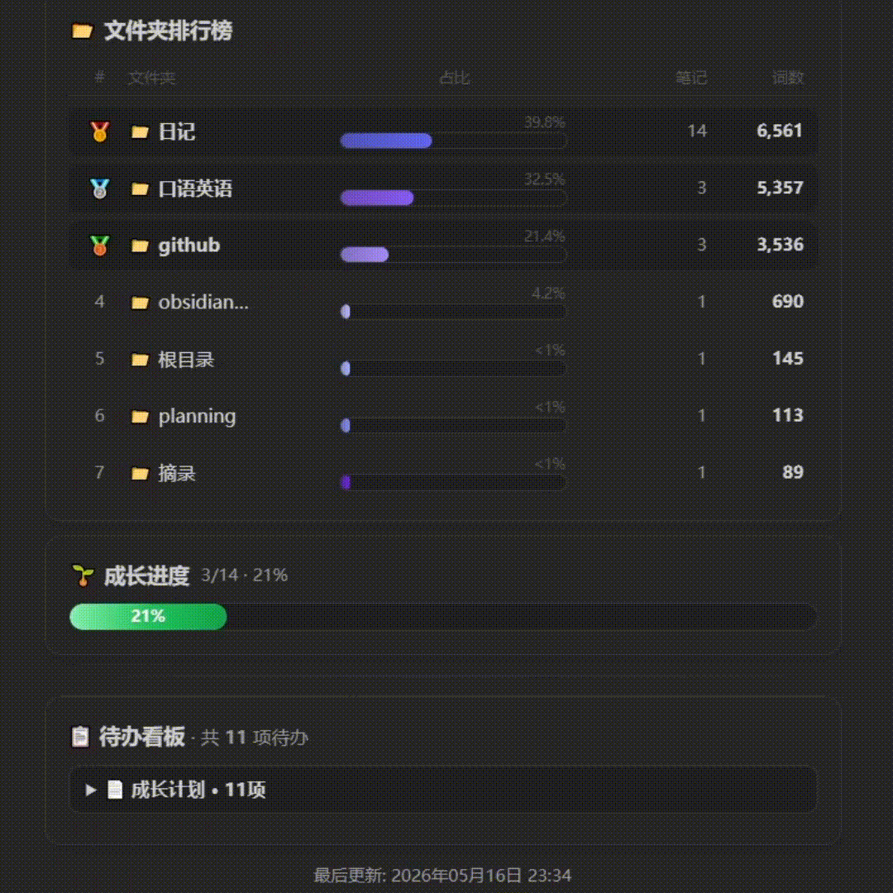

<p align="center">
  <a href="README_EN.md"></a>
  <a href="#"></a>
</p>

<p align="center">
  
  
  
  <a href="https://github.com/Inonvation/obsidian-note-dashboard/releases">
    
  </a>
  
</p>

<h1 align="center">📊 Obsidian Note Dashboard</h1>
<p align="center">基于 DataviewJS 的笔记统计看板 —— 热力图 · 写作统计 · 文件夹排行 · 待办聚合</p>

---

## 📖 目录

[效果预览](#preview) · [动画效果](#animations) · [功能介绍](#features) · [依赖](#dependencies) · [使用方法](#usage) · [自定义](#customization) · [相似项目](#similar) · [更新日志](#changelog) · [参与贡献](#contributing) · [Star 历史](#stargazers) · [许可证](#license)

---

## <a name="preview"></a>🖼️ 效果预览

### 📱 移动端

<p align="center">
  
  <br><strong>🔥 热力图 + 📁 文件夹排行</strong>
  <br><span style="color:#586069;font-size:13px;">近一年贡献 · 5 级绿色渐变 · 词数奖牌排行</span>
</p>
<p align="center">
  
  <br><strong>📊 统计总览 + 📋 待办看板</strong>
  <br><span style="color:#586069;font-size:13px;">笔记总数 · 活跃天数 · 连续天数 · 待办聚合</span>
</p>

### 💻 桌面端

<p align="center">
  
  <br><em>全功能看板 · 阅读模式展示</em>
</p>

---

## <a name="animations"></a>🎬 动画效果

看板在 v1.2.0 中全面重做了动效系统，所有动画在打开时依次触发，总时长约 1.5s。

<table align="center">
  <tr>
    <td align="center" width="50%" style="padding:12px;">
      
      <br><strong>① 热力图</strong>
      <br><span style="color:#586069;font-size:13px;">逐列淡入 · 从旧到新 · 间隔 30ms</span>
    </td>
    <td align="center" width="50%" style="padding:12px;">
      
      <br><strong>② 卡片入场</strong>
      <br><span style="color:#586069;font-size:13px;">四向滑入 · 弹性缓动 · 间隔 80ms</span>
    </td>
  </tr>
  <tr>
    <td align="center" width="50%" style="padding:12px;">
      
      <br><strong>③ 进度条滑动</strong>
      <br><span style="color:#586069;font-size:13px;">从零填满 · ease-out · 600ms</span>
    </td>
    <td align="center" width="50%" style="padding:12px;">
      
      <br><strong>④ 数字弹入</strong>
      <br><span style="color:#586069;font-size:13px;">从 0 递增 · 缩放脉冲 · 800ms</span>
    </td>
  </tr>
</table>

> 💡 另有 **⑤ 标签脉冲** — 「本月」「🥇🥈🥉」等标签持续呼吸闪烁（透明度 1→0.6→1，周期 2s），为 CSS 动画，无法通过静态截图展示。

---

## <a name="features"></a>✨ 功能介绍

<table>
<tr>
<td width="33%">

**🔥 近一年贡献热力图**  
按每日写入字数着色（5 级绿色渐变），月份标签左侧冻结，支持横向滚动。自动适配浅色/深色主题。

</td>
<td width="33%">

**📊 统计总览**  
6 张统计卡片 + 本月活跃进度条：笔记总数、总字数、活跃天数、今日已写字数、当前连续天数、文件夹数。

</td>
<td width="34%">

**📆 月度统计**  
每月笔记数 + 字数进度条，当前月份高亮标记，最多支持 12 个月数据展示。

</td>
</tr>
<tr>
<td>

**📁 文件夹排行榜**  
按总字数降序排列，每条带百分比进度条和 🥇🥈🥉 奖牌标记，一眼看出哪个文件夹最活跃。

</td>
<td>

**📋 待办看板**  
聚合所有未完成任务，按所在文件分组。≤6 项的组默认展开，超过则折叠，保持页面清爽。

</td>
<td>

**📱 全平台适配**  
响应式布局，手机 / 平板 / 桌面均可正常显示，触控端支持热力图横向滚动。

</td>
</tr>
</table>

---

## <a name="dependencies"></a>📦 依赖

| 软件 | 版本要求 | 说明 |
|------|:--------:|------|
| [Obsidian](https://obsidian.md) | 0.15+ | 笔记软件本体 |
| [Dataview](https://github.com/blacksmithgu/obsidian-dataview) | 0.5+ | 必需，JavaScript Queries 需手动开启 |

> ✅ 无外部 API、无需 API 密钥、无付费服务。单文件 481 行，开箱即用。

---

## <a name="usage"></a>🚀 使用方法

### 1. 安装 Dataview 插件

```
Obsidian → 设置 → 社区插件 → 浏览 → 搜索 "Dataview" → 安装 → 启用
```

进入 Dataview 设置页，勾选 **Enable JavaScript Queries**。

### 2. 下载看板文件

从 [最新 Release](https://github.com/Inonvation/obsidian-note-dashboard/releases) 下载 `📊-我的笔记看板.md`，放到你的 Obsidian 库任意位置（根目录或子文件夹均可，代码会自动适配路径）。

### 3. 打开看板

在 Obsidian 中打开该文件，等待几秒让 Dataview 完成索引。看板会自动切换到阅读模式，展示完整数据。

> 💡 **首次打开显示空白？** 在命令面板（`Ctrl/Cmd + P`）中执行 **Dataview: Force refresh all views** 即可。

### 4. （可选）设为主页

Obsidian 设置中将其设为默认启动文件，或搭配 [Homepage](https://github.com/mirnovs/obsidian-homepage) 等插件使用。

---

## <a name="customization"></a>🎨 自定义

所有可调参数统一集中在 `📊-我的笔记看板.md` 顶部 `C` 对象中：

```javascript
const C = {
    exclude: ['附件', '模板', 'copilot'],   // 排除的文件夹
    days: ['', '一', '', '三', '', '五', ''], // 星期标签（空字符串不显示）
    colors: ['#6366f1','#8b5cf6','#a78bfa','#c4b5fd',
             '#a5b4fc','#818cf8','#6d28d9','#4f46e5'],  // 月度进度条配色
    heatColors: {
        light: { e:'#ebedf0', c1:'#c8e6d0', c2:'#6cc085', c3:'#3a9d5e', c4:'#1f6e3a' },
        dark:  { e:'#2d333b', c1:'#1a5435', c2:'#2b7448', c3:'#409660', c4:'#57ab76' }
    }
};
```

| 参数 | 说明 |
|------|------|
| `C.exclude` | 排除的文件夹名，按需增删 |
| `C.heatColors` | 浅色/深色主题的 5 级热力色板 |
| `C.colors` | 月度进度条的 8 色数组 |
| `C.days` | 左侧星期标签，默认只显示一、三、五 |

> 💡 在库中创建 `planning/成长计划.md`，写入 `- [x]` / `- [ ]` 任务清单，看板会自动检测并显示完成进度条。

---

## <a name="similar"></a>🔗 相似项目

| 项目 | ⭐ | 差异 |
|------|:-:|------|
| [vran-dev/obsidian-contribution-graph](https://github.com/vran-dev/obsidian-contribution-graph) | 432 | 独立插件，热力图交互更强，不含统计 Dashboard |
| [InlitX/Obsidian-Dashboard-Gallery](https://github.com/InlitX/Obsidian-Dashboard-Gallery) | — | 侧重视觉设计和布局，不统计词数 / 文件夹分布 |
| [yirsi/obsidian-habit-heatmap](https://github.com/yirsi/obsidian-habit-heatmap) | — | 带游戏化系统的习惯追踪，与笔记写作统计不同方向 |

---

## <a name="changelog"></a>📦 更新日志

**v1.3.0（2026-05-17）**
- 🐛 热力图不随周次更新：切换到滑动窗口机制（54 列），每周日自动右移
- 🐛 日期锚定错误：改为取「有数据的最后一天」与「今天」中较晚者
- 🐛 未来日期跳过数据查询：预写日记不显示颜色现已修复
- ✨ 未来日期用最淡色填充而非留白
- ✨ 月份标签改用绝对定位，窗口边缘被截断时不显示
- ✨ 颜色阈值放宽（200/800/2500 字符），梯度更合理
- 🧹 去除冗余变量、提取动画延迟函数、块级作用域改造、常量分组注释

**v1.2.0（2026-05-16）**
- ✨ 自动切换阅读模式，多面板兼容
- 🎨 动画重做：4 种卡片入场、进度条滑动、热力图逐列淡入、数字弹入、标签脉冲
- ⚡ 内容缓存机制，二次打开秒开
- 📉 代码从 521 行精简到 481 行
- 🐛 修复多面板 / 热力图滚动 / 进度条跳动等 Bug

**v1.1.0（2026-05-16）**
- 🔧 全局配置统一到 `C` 对象
- 📝 词数统计优化（中文按字、英文按空格分词）
- 🎨 卡片入场动画 + hover 上浮交互
- 📐 全局 `nd-` 前缀 CSS 类名，渲染更干净
- 🐛 自动回正预览模式，隔离全局变量冲突

---

## <a name="contributing"></a>🤝 参与贡献

欢迎任何形式的贡献！

- 🐛 提交 [Issue](https://github.com/Inonvation/obsidian-note-dashboard/issues) 报告 Bug 或提出功能建议
- 🔀 提交 Pull Request 改进代码
- ⭐ 点亮 Star 让更多人看到这个项目

---

## <a name="stargazers"></a>⭐ Star 历史

<p align="center">
  <a href="https://star-history.com/#Inonvation/obsidian-note-dashboard&Date">
    
  </a>
</p>

---

## <a name="license"></a>📄 许可证

本项目基于 **MIT 许可证** 开源，详情见 [LICENSE](./LICENSE) 文件。

<p align="center">为 Obsidian 社区用心打造 ❤️</p>
