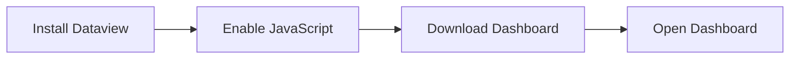

  
  

<h1 align="center">Obsidian Note Dashboard</h1>

  <strong>A single-file note-taking dashboard built with DataviewJS</strong>

  <a href="#-preview">Preview</a> · <a href="#-features">Features</a> · <a href="#-getting-started">Getting Started</a> · <a href="#-settings">Settings</a> · <a href="#-changelog">Changelog</a>

  
  
  
  
  
  

  Heatmap · Writing Stats · Folder Ranking · Task Board · 7 Color Schemes · Cross-platform

---

## Preview

<table align="center">
  <tr>
    <td align="center" width="50%" style="padding:8px;">
      
       <strong style="color:#6366f1;">Heatmap · Folder Ranking</strong>
       Yearly contribution · Word count ranking
    </td>
    <td align="center" width="50%" style="padding:8px;">
      
       <strong style="color:#10b981;">Stats Overview · Task Board</strong>
       Total notes · Active days · Task aggregation
    </td>
  </tr>
</table>

  
   <em style="color:#586069;">Desktop · Full Dashboard</em>

---

## Features

<table>
<tr>
<td width="33%">

**Heatmap**

54-column sliding window, 5-level gradient coloring, horizontal scroll, lazy loading

</td>
<td width="33%">

**Stats Overview**

6 stat cards + monthly activity bar, counter pop animation

</td>
<td width="34%">

**Bar Chart**

Monthly/7-day toggle, auto-scaled Y-axis, rise transition

</td>
</tr>
<tr>
<td>

**Folder Ranking**

List/pie dual view, anti-collision algorithm, sector expand animation

</td>
<td>

**Growth Progress**

Auto-detect growth plan, gradient progress bar, shimmer effect

</td>
<td>

**Task Board**

File-grouped, priority/due date markers, click to complete

</td>
</tr>
<tr>
<td>

**Settings Panel**

7 color schemes one-click switch, all configs visual adjustment

</td>
<td>

**Smooth Rendering**

Force reading mode, eliminate flicker, instant re-render

</td>
<td>

**Cross-platform**

Responsive layout, works on phone/tablet/desktop

</td>
</tr>
</table>

---

## Getting Started

### Prerequisites

| Software | Version | Installation |
|:---------|:-------:|:-------------|
| [Obsidian](https://obsidian.md) | 0.15+ | [Download](https://obsidian.md/download) |
| [Dataview](https://github.com/blacksmithgu/obsidian-dataview) | 0.5+ | Settings -> Community plugins -> Search "Dataview" |

### Installation Steps

**Detailed Steps:**

1. **Install Dataview**
   - Settings -> Community plugins -> Search "Dataview" -> Install -> Enable

2. **Enable JavaScript**
   - Toggle `Enable JavaScript Queries` in Dataview settings

3. **Download Dashboard**
   - Get `.md` file from [Release](https://github.com/Inonvation/obsidian-note-dashboard/releases)
   - Place anywhere in your vault

4. **Open Dashboard**
   - Open the file in Obsidian, wait for Dataview indexing to complete

> **Tip:** Blank on first open? Run `Dataview: Force refresh all views` from the command palette.

---

## Settings

Click the gear icon at the top-right corner of the dashboard. All configs preview in real-time and take effect immediately after saving.

### Color Schemes

| Scheme | Indigo | Emerald | Amber | Rose | Sky | Coral | Slate |
|:-------|:------:|:-------:|:-----:|:----:|:---:|:-----:|:-----:|
| Primary | `#6366f1` | `#10b981` | `#f59e0b` | `#f43f5e` | `#0ea5e9` | `#f97316` | `#64748b` |

### Configuration Options

| Config | Description |
|:-------|:------------|
| Exclude Folders | Folders to exclude from statistics |
| Ranking Count | Number of folders to display |
| Task Expand Groups | Default expanded task groups |
| Growth Plan Path | File path for progress tracking |
| Priority Tags | Custom priority markers |
| Due Date Emoji | Custom date emoji |
| Estimation Threshold | Word count estimation boundary |
| Estimation Coefficient | Word count estimation factor |

All configs can be customized via Frontmatter YAML. Color schemes are persisted via localStorage.

---

## Changelog

### v2.2.1 (2026-05-28)

**Bug Fixes**
- Fixed multiple display issues in settings panel
- Fixed dashboard rendering errors

**Performance**
- Optimized rendering logic and code structure, reduced resource usage
- Data statistics changed to incremental mode, significantly improved initial rendering speed

### v2.2.0 (2026-05-27)

**New Features**
- Added visual settings panel: click gear icon at top-right corner
- 7 color schemes: Indigo, Emerald, Amber, Rose, Sky, Coral, Slate
- Frontmatter config support: all settings customizable via YAML
- Help tooltips: question mark icons on non-obvious options

**Performance & Optimization**
- Load resilience: single note failure no longer crashes the entire dashboard
- Task sorting optimization: improved speed for large task lists
- Completion reliability: auto-recovery on task marking failure
- Plan parsing enhancement: supports more Markdown list formats

**Code Refactoring**
- Extracted common animation function: unified fold/unfold logic, ~80 lines reduced
- Config system refactoring: all hardcoded personalizations unified as configurable items

Historical Versions

| Version | Date | Highlights |
|:--------|:----:|:-----------|
| v2.1.1 | 2026-05-26 | Expand/collapse precise height transitions, pie chart centered |
| v2.1.0 | 2026-05-24 | Lazy loading optimization, error boundary |
| v2.0.0 | 2026-05-22 | Task board refactored, priority/due date markers |
| v1.4.2 | 2026-05-19 | Fixed heatmap calculation errors, dark mode preview switch bug |
| v1.4.1 | 2026-05-18 | Fixed potential freeze, re-render jitter, mobile first-launch issue |
| v1.4.0 | 2026-05-18 | Smooth rendering engine, eliminated flicker; full-width layout |
| v1.3.0 | 2026-05-17 | Heatmap 54-column sliding window, color threshold adjustment |
| v1.2.0 | 2026-05-16 | Auto-switch to reading mode, 4 entrance animations |
| v1.1.0 | 2026-05-16 | Unified global config `C` object, Chinese/English word count |

---

## Contributing

Contributions are welcome!

1. Fork this repository
2. Create a feature branch (`git checkout -b feature/AmazingFeature`)
3. Commit your changes (`git commit -m 'feat: Add some AmazingFeature'`)
4. Push to the branch (`git push origin feature/AmazingFeature`)
5. Create a Pull Request

---

## License

This project is open source under the **MIT License**. See [LICENSE](LICENSE) file for details.